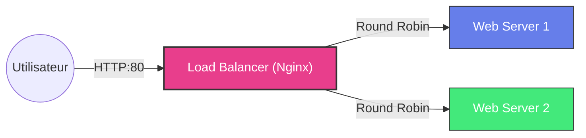

# 🚀 Ansible Load Balancer Project

Un projet Ansible complet et pédagogique qui déploie automatiquement une architecture **Haute Disponibilité** composée d'un Load Balancer Nginx et de 2 serveurs Web.

## 📊 Architecture

Le trafic entrant est distribué intelligemment entre les deux serveurs web.



---

## ⚡ Quick Start (Simulation Locale)

Vous n'avez pas de serveurs sous la main ? Pas de problème ! Ce projet inclut un environnement de simulation **Docker** complet pour tester le déploiement sur votre machine en 2 minutes.

### Prérequis
- Docker Desktop installé.
- Un terminal (Git Bash, WSL ou Linux).

### Démarrage Rapide

1. **Lancer l'environnement simulé :**
   ```bash
   ./setup_local_env.sh
   ```
   *Cela va créer 3 conteneurs (web1, web2, lb1) et générer les clés SSH nécessaires.*

2. **Lancer le déploiement Ansible :**
   ```bash
   docker exec ansible_control ansible-playbook -i inventory/docker_hosts.ini playbook.yml
   ```

3. **Tester !**
   Ouvrez http://localhost:8080 dans votre navigateur.
   - Rafraîchissez la page plusieurs fois.
   - Vous verrez le fond changer de couleur (Violet ↔️ Vert) car le Load Balancer distribue vos requêtes tour à tour sur `web1` et `web2`.

---

## 🌍 Déploiement Réel (Production)

Pour déployer sur vrais serveurs (VPS, Cloud, Bare Metal).

### 1. Prérequis
- Ansible installé sur votre machine (`sudo apt install ansible`).
- 3 serveurs Ubuntu (20.04+) accessibles en SSH.

### 2. Configuration
Éditez le fichier `inventory/hosts.ini` avec vos IPs :

```ini
[webservers]
web1 ansible_host=203.0.113.10 ansible_user=ubuntu
web2 ansible_host=203.0.113.11 ansible_user=ubuntu

[loadbalancer]
lb1 ansible_host=203.0.113.12 ansible_user=ubuntu
```

### 3. Déploiement
Lancez simplement :
```bash
ansible-playbook playbook.yml
```

---

## 📂 Explication du Code

Pour ceux qui veulent comprendre comment ça marche sous le capot.

### structure
```
.
├── group_vars/      # Variables de configuration (Ports, Noms, Couleurs)
├── inventory/       # Inventaire des serveurs (IPs, Utilisateurs SSH)
├── roles/           # La logique d'installation
│   ├── loadbalancer/# Configuration du proxy Nginx
│   └── webserver/   # Configuration du site Web
├── infrastructure/  # (Pour la simulation Docker seulement)
└── playbook.yml     # Le point d'entrée principal
```

### Détails Techniques

#### Le Load Balancer (`roles/loadbalancer`)
Configure Nginx en mode Proxy Reverse. Il utilise une boucle Jinja2 pour générer dynamiquement la configuration `upstream` basée sur la liste des serveurs définie dans `group_vars/loadbalancer.yml`.
- **Algorithme** : Round Robin (configurable).
- **Health Checks** : Vérifie que les nœuds sont en vie avant d'envoyer du trafic.

#### Les Web Servers (`roles/webserver`)
Déploient une page HTML statique personnalisée.
- **Templating** : Le fichier `index.html.j2` utilise des variables Ansible pour changer le titre et la couleur de fond (`page_gradient`) selon le serveur. Cela permet de visualiser facilement sur quel serveur on atterrit.

---

## 🛠️ Personnalisation

Vous voulez changer les couleurs ou le port ? Tout est dans `group_vars/` !

- **Changer le port du site** : Éditez `http_port` dans `group_vars/webservers.yml`.
- **Changer la méthode de load balancing** : Éditez `lb_method` dans `group_vars/loadbalancer.yml` (choix : `round_robin`, `least_conn`, `ip_hash`).
